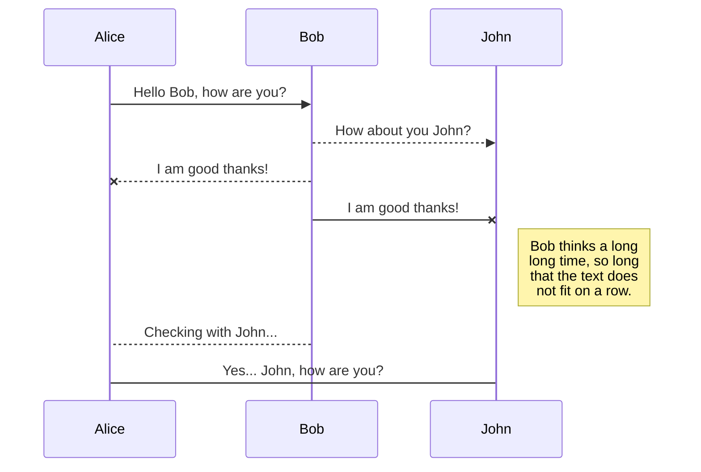
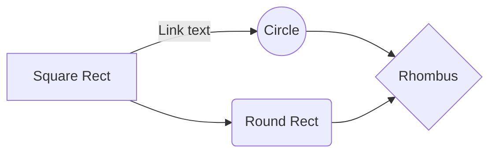

# PYTHON  with markdown
![Alt text]([[[data:image/jpeg;base64,/9j/4AAQSkZJRgABAQAAAQABAAD/2wCEAAkGBwgHBgkIBwgKCgkLDRYPDQwMDRsUFRAWIB0iIiAdHx8kKDQsJCYxJx8fLT0tMTU3Ojo6Iys/RD84QzQ5OjcBCgoKDQwNGg8PGjclHyU3Nzc3Nzc3Nzc3Nzc3Nzc3Nzc3Nzc3Nzc3Nzc3Nzc3Nzc3Nzc3Nzc3Nzc3Nzc3Nzc3N//AABEIAL0AyAMBIgACEQEDEQH/xAAcAAACAgMBAQAAAAAAAAAAAAAFBgMEAQIHAAj/xABGEAACAQMDAgQDBAUKBAUFAAABAgMABBEFEiEGMRNBUWEUInEyQoGRFRZSobEHIzNicoKSwdHwJEVT8UODk8LhJTRVY3P/xAAZAQADAQEBAAAAAAAAAAAAAAAAAQIDBAX/xAAkEQACAgICAgIDAQEAAAAAAAAAAQIRAxIhURMxBEEjUmEiFP/aAAwDAQACEQMRAD8AvA4OQ2D6gVuRnaeMUAXqjTm2/wDEKM981YPU2k/duo+PrXnODPX8kewoXBGNpPvWpXPfNUZOoNP8Pcby2XPZFNRtr+mMuReRUtGPyR7CZC7dvlW58PYqx5Oz7WaFfprTeP8Ai4+fftUn6X01m4u4iT6tRqw3j2WtwbgA4rwGw7vmxVYalYu3hxXURb+1WTeQA4+IjJ9CwpasrZBCJlORuOB7VV1Aq1ndKTnC/LnyrWK7tlYq0sYJ/rUE13XrXLw2e6RiMMx4UfjVwi7MMjjXsKm8S0tYkV1UbFJy2FGR/H2qA6w6HEcsZ9scGk24utzrJcSrjGAG5wKpvqMCcR3D5/qDFb+FWYf9Feh/h1iJm8N3WOXPCvwD+NFbl1LAIQPlBbntXJjqFzJtKtJIF7ZA/wBKvW/VN5CWIQMduCCTzSeHjgqHyFfJ0drpC6B3Bye9SgRZDLNx54pDt+qHMRWCGPdu7M2TirdhrKpIpn8RAx5GcqKzeJmsc8RyWTZkKTtNbO5wBGp/Oh0epWkuGE8QB9TUjX1kG2m5QH+1WOrs2U4lwPvXDBsewrAUeJg8H1NRG9tQm4zIAex3ivPc2zJv+Lt8e7803FlKcSYSOnYj8a1IZ88suaqfG2rthLmI/wB6tX1C2jz/AMZAuP69GshOUS0q5bbVZ93xuSAAFPNe/Slkg3GeP/GKFv1BayXww0eFQ8bu5qowZE8kUG2lDYUceteoVFq1oZPmmj3N90ntXqvQjcqy9JaYOCkuc/tVEej9KYZCygem7mj8+Xdmz27VpGONxbP1rJ5ZGqwQ6F6/6W0iKzleJZVkXG0k1hOjLLasnjTHIGRxRvVfmsZMkcCtrRdsKtuyrAd60U242R4ob+gOOktNOMGX86lXpHTNuXRyf7dGwMjvg1soIjzjI8/rUPJI0WGHQCHSOk/9KT/1DWrdI6T28Ob6eJR4SDPtQ/ULt4llaJ0iWNSSzcknH/ahTk3QPFjSuhP1+10rTrkW1lHL4wHzEyEgHyFV0gKoviMA3pntQ74gyXTXMrFpXbOTUwuAGDyOCc9j3ruhGkeVklb4MX9sAu9WJXt7saFLAfmcHBXyFMUEnjJlsAfdz5e9Dr+CKI7LfezEZLYqjOyKxuGDgKQFPkTyDRNlilbJGH/jQcIkEuJgGiPBHmKnRTAxZJGZB557elAMtfDhHDLkAfaGeRVkH5cH5X8jVNrkkrjbvHJGftCrBdZ1RlzkcfjTA2kiiIAlQkDvtJBph03pDStQtRcR3VycjB5+yfelyR96shJWVRke4o70JeOtzcWjnAKb0GexHcVjkVK0dGB3KpF/9RdMH257k/36kHQ2kbcmS5P1kphZv95rYZxjNcvkkd/ij0Lv6j6KrA7bgjz/AJ0179S9FIZhHPt/tmjzKQSQSM+9SQhyj4yUA70Kc+xPFDoAL0boZXlZv8VSfqdoYRtsT/4zRHcynJYCtg7rkBsg+dHkkPww6BB6M0YeUpPrvNeos0x9cfWvUt5B4YdEe9AmfEGKiEqg58VR7Eign6nOeBqUv5msnoznH6RkJp6R7B5Z9BXU7iL4OQb0y3b5qmt5UEKLuTt+1Qf9Romj+e+Zj7g1G3RgT/mEn76esaqzPfJd0H0ePOfEH+IUURojpDbXQOW3d/KksdHbe+oSfvqT9TmCjGpzbSO3NUowQ5ZMj+gvc3sVvbyyblOwcZbzrnWqatPdGRTOzoXzjGKMdQaJHpFiZGvnlcsAEbzpOcBn3t9mtMOOPs5/kZZPj0Tl/TGPX0rVBucFQXY+tQNIZBtVSFHf3qxbQSyOEhJBHmPKuj0ciVlpdyKPEBJ/ZH+tW1HijDMI1PcjuR6VLaaNKSCQWJ9TV59FuSo2kjHtU7IrRgIwJKrsXJJI2+9WERIol4AZe+fy/jV1rSW0g2GMtIc5OO9Do4ppp40IJMhxTUkS4sqybhcNGR8udykeTf7/AIVgXZRt44B7+lEJNPuELb1OB/vIoTcDazKQMelNSTDVhJLuNnikfyGGqbSrz4DV7eZJAq79hPlg+RpfLEY21NbjxIpF8+4zSkrKi3F2dlaZSisMHcAe9ZEoGcsBj3pN0jpiXUtMtr0arcR+InKgE4OcY/jVyPo1yTu1ecgj371xuEU/Z6KyzatIZXnj/wCoPzqeC5jNpLGJkG7yDDNKn6ksw51SbP0rZOg3LjbqT5wTnmqjGPZM8s0vQZ8WNmx4iH6tXnlRQAZAAfQ0rL0mz6gLVb4hjnByeatzdDThcnU3XHpmjSPYLNN/QeVo5O0ynis0vnosDG3VJG9e9eparsPJPobI2xIT4ZyPetwyswYqRmtOPDO0YPnmtY5BvAY8CsaZ1pWWd+O2PzqFmPOc8VhGb0H5V47+felTBmFJ8zU24NCckgheB61CnuDUgj320u1guBwfOmosls511vLG+ouhbdtQZ54Vvak+TcePLNX9UEqX88c7MXWQ7iT39TUUMO8KWIAbIH14rvgtYnk5JOUglpGkCa2M5VmbsqAcMfrTXoGgNHATInzsecijfQliP0OpdQWY57U2wacilcAYHfBrKc+eDWEOwHa6UiKDtHFTy2S7OF7d6YUhjAxxXpbdCPlAxUGolXGml4m2jlu3tVW16ciWWOTB3R8jinb4aMHkcVstvGDgMM00DihWu9MRlI2jOMVzrqbSzbSlkGBjmu0y2y5J459s0m9a6aXtZXRMkCiEqkROFo5L2bB4+tWIkOAUIYH0qtOrK5EnBB8/SswyBcbePpXUco/9E3ZW3eykeT5H3KoPHP8A2NNeMS4JI5z3rmvTt5L8fHHBIweUhATxXS0B2/znzE9sVx5o07PR+NO40zIk5KDOR97FTwSsiKAcnGDmoNoViFUnPrXhKFdgO+e1Yq0dLVlO7df0ja/KC4JG4fSrhkJwNpA880PuDm/tey5J5/CiYYEEMQc0NslIiXnOec16skoGwDXqXI6FGTReqFXMlxtb9kvUQ0fqngmUbSf26eFkPmc/XmoGkzwBxW7yLo5lga+xaOg9QRKGkuSBkZO/gCr46b1U4zrTDJ/Z8qKX0jCzkAZgAvrV2zfdbIXJLFRSeQaw88sWn6f1Rf8AnTn6LWP1d1Xbn9MsB6EUznCe/wBKyx+Xnmp8jLeCPZxzXrSe2v7iKfcWDEK7DG/3qGzga5mt7ePBZnwPrT1/KBp013bW08CGRomKsB3wRQL+T60W76oiUjKxKXP4YH8a6YzuFnDkx6ZKOkpcWvTulReM23C4UY7mly7/AJQ7tFbw4UAzw2D2o31bp8c7wy3ORDFyRmk6fUriWOZ9OsYYoogAnixkmTnuKmNFZNi7bfyi3rOBcIpHmAOf408aZrKXltGy5+cVymK5viHmnt4TGuNymHaffFdS6CtFurcytHiPAIB8hRNFYrM6vrAsLZpHXnypUu+vWtdjRRqztjIY8CnDrHS4pI8BcjHIrlt6+LiWG3tI8xrkmRT82PIetEf6PJf0M9n/ACjrL/T2wPH3W7UXj17TdYTwxKqvgDYfOkCz1NiHWfR7ZgqkkqCpP+tEtLsrG/nhubHxISGyybcYokokwcibrfpqN7T4u1iAkQfNjzFc5jRdxVjjHtXfbmESWDRuuSy4NcKuYyl1Kpz8rEVWGTfsnLGjMDvHNA0TjxFbgin4aD1G6hzecHBGG7cVzkEgEDgA5wK7dpc7Pp9s2SQ8Kt+YFLK1EeCLk3yLP6v9Q5yNQ/fUjaD1II1Hx8OO45702BmTvXjIxfk59hWPkXR0+H+iaNC6ikIM17CCnIINbvoHUrf8xjX6U5grGDzya2BXbn17Utw8X9Ef9CdSBx/9Ri59q9Ti52uM+Vep7h4/6UozxyRmvKABgigEd11BJkpYAkVHJfdSE/JpwIHfFTozXzRD142+3dQvLCrlvJGqKAytgeRpOlvuoZUZPgwgPYkVUP60W7nC7d39WnHHwZyzJM6Bk4zsJX1FbM4MIbbjJ7k0hpc9UFQodwD5bayZuqJUC7jtB7bKp4heddDudr8AA545/dS90zYx2XWl7FCuBFGEIH7WFJoZbr1HJcRAhiN65yPLP+lNVpava9a6oWG3x1Eqn1BA/wBKcY6IWSe7Q2NYR3S/Ogf61TvOnJ3/AKGWLZ6FKK28yxxjB5NTyagir82PzojwKhWj6VWN911IH5zhFwDTHocKW0ckcaYUAYFDpdZjlu0toI2kkZgMUwWAXYTjB86ftg+ECL4tPNIG7dqC33TiXDeJC/hyZzhhkUY1B3R3WKMu2ecVRTUtrYkVkbPINK6ZetopQdOXYyrLagHgnaeauR6LBbdlAf7xC0ZtdQSWLO7I9DWJpkck9s0S5JUQLeERwEDyHnXGf0fJqmrzwwEIzsxBbtwa7BrL7IHYdgDSX0To73d3dX0qkQwsuOO57kU8bpMzyraSQgzafcRan+j9pMxcIBjzP+812W1t/h7eOBOQihRyOwpC1OHUx1be3Wn23jtDJs3Y4Vsf5dqIxXHVbjPwqE+4p5VtQYn42+BzUj7xrRsK/BpW39WZ+a3hAxke9aSfrUTkRxD6gVl4jZZr+hsxzncDW6YK4yc0o7eq17rAv0FRmTq5rnwYo4PE2BjjyGaPHyHmdehy2A8seR3r1KLL1kD88cA9x2r1PQnyPoaIy6HKkj6VK7O6cn8uKwQVB7ZFeViFIccj0rKzekQspYAkkgVIMA5yT9awQwJOUK+gPNQXE8cCbnb8KFY+CwxBxg9vavBsxYQ5NUoNQjlfagfPfBWrpwQNyjPnTsSSZlX+bceTV2a7t5Z4C6bbliUVj5jHbP4UO2ttJQdqo3ljI+oWt6spJt5Q2w9sedOLv2TkXAx3F0ImAB7ChOp6nIqfJyT2FWr5d7AqeDQzUoEtZvFkGSUADHtmrRm5argzo9zLZTm5kHjOQRxwQaK2fWUczuirskQ4ZTwfrS5ZazpC/wD3d2ivnaIfvflVW8h0u7ut0TyRHP3kI/hWlJEbNjJJ1xbLebEt5J2Jx8o7mp7qb4qNpEQxyMMj2pZsrfS4CjfGpkE4ODRqfULRYP5u9hIAGcMMfvpUmPZoisdQZJjDJ8rjuM8Gi0N9vbaSKW7V7e9lSSAhWU9w2c0TlTwrogZOAO3r51nJUylIIX2JYcEfaJBoXB1VoGlaWIbeeMyhv6KPJZ3zjFZ1e8NvpkzrksEIXnzPauPaTbTXOpQqiFiXBLVeONxbZnObUlR1m1UQ24CDBZt7e7Hkn86tLI6oOe9QL8yp5YHapMs6HAGF8xXO2dqSJDcSEKC2dvao2dm7mtcf7zXgGLYGPzotj1J0dvJ6rRM0WssyNndDz+dTTACQqo4HnVSBWOqeIDgeFinzyS+aCjSN68elerUjPp+derHZl6igvWKhiwsrkqe2UqZurzgqllcZI8xTHGkYDDw1/KsGGPdv2gD6Cuq4HM45f2FgdVyFsfo+YAjkgZNY/WKNSDcadctk+mcCmxI4PFBdRgegFamZInCxrGwb5eV/hTUo9EyjlS9i1fdXvJOkltpk6so2nMfetG6ousknTp+f6ppwMnzDKICPYVpLIx7Kv+EUOUX9BGORLhih+tN5CzMNOndfZTWV6nvptxj0q4wBgjaeKbGuGRCdi4P9WoBPIfvkZ7486No9DcMj+yPSdQN7ZJJNG8MnIaNxyD6/SixEN4gSYBgKHszzHIx8varFhIu5gRgjuD5Urslpx9lTU+kLHUV3bPDmX7Mirgipbe2urKUi4a2l74DDwzzj6+lMaRsybgcgihGpw3IYkFufSrXKDj7Kc1o89qtvGlrA/k5O7HfyH1qCLom0kmWbUSLh17AjC/lVrTo7sygnjBpit4pAgDjcfPNN/wCfQcMFQ6ZBZYMESgDtgVUnyCxxyDk0R1O58H+bTBwfm5+yKXLm6Z5xBAS8jfwrP2J0ir1BFJc6ZcbAWYFVRQe7E0odOy3VrAGgsGlIY/Ng989vwrqVhpyiKCNwDtkErfXyqy0MNiCqIEjdiwwPM962SqFmN/kpM57+ltUBDfoxmx9ayNc1Ur8mnOhI8809M2BwwB9K8shA3qeKy2j0b1k7OeS9Qawn2dNY/wB01iLXdZzn4DHsQa6BJgBQuSx7YryDjODuHfIo3h0GmT9jnE/UWuLIdliTny8M1mx6i1yG4eSXTJZA3bCniui+Gmc7TXiO+FJz6U/JHofjn+wkDqjWf/wr/TBr1PAx/wBMg+pNeqdodD1yfsVFPf3rZgABuOSfKl9OqNP/AG2/w1q3VenAhtznH9Wp1Zflh2H3kEY+YHJ7Cq07AyRYkCkSAjjv7UKfqrTZG+1IG/sUMuupIZJ42RXZUfO0LzTjF2TPLCvY3yO5kyWFZVm8yaX/ANadMwDJ4yHzyvatz1XpLY2SSHI/YocGUskOw/jcMZJFbCL9lc0Dj6q0od5HP92tj1bpgcqZJEA89tTpIryQ7DsbMmcHv7V50LoGHDqOMULstf0++uUt7WR3kfy29h5kmttM1mG91qazj/oljJR/NyO/4VSjJcmeScHwhn0bU4niKyHBHdT5UWaa3wAApz6Gk6+tW3eJC3hyefofrQ6TUL22OJM4HmtWmY3Xs6CLiLPJQD61Xv8AUYIYztcBj6UgNrk7jCqzY70PuLy7u8J9geueaYtgvqWrPcz+DbDdIePpV7RbMQ8j+clc/Mx7n2+lC9MtEgQZGXJ/FqbtNtTHGrSAeIePYD0FVCO7M5z0Retowqds+tTywiaBkAwe4z5V6FeVXyq1t548/M+ldmqqjk2d2Kk8bxyOGXG0gE+X1rQHacZBFG4Cly8kkijY7kD02g8f51mfTYZQfC+VvI44rkl8d3/k7sfyk1ygJnByGrCs2SW8+9aXouraWSIabezMo4aKEsp/EUGuuprO0k8K/iuLWXyWWErn35rB45L6OhZYP7DgdvQ1tEzFsKCPellOstLORvlJ8sITUi9aaWpyHlHsYzRox+WHYyZwxDAHFepeHWWkA7mabB8/DNeo8bF5YdlwWtoOfhIP8ArBjsz8vwdvj/8AmKlGNpTzFaeGQckijZl+NdG6W9uFyLW3X/yxWzLAAAbSDj0jFaDO/vn2rxJ9aTkxqC6JiLUQYe0hZCfmAUdq0eOz8RV+Et0HtGK2V/Dj4w24Y7VGsTuRtU7/ACUc07YnCK+iRlth8wtYQmeCIxUchtShVbeIKfWMZotb6U6GOS8fYc/YHJ/H0qaC2tpbgRw2yN5mRjnitlinJXZzTzYouqFbXiunaJmCJEmuQcsi4ITtj8TSTod8bTqOwlkOFeXY30biul9VWiXiyDI+UBVA7YHauR6qvw+pWu0/ZcfxrfTijk2t2dqdQADjvQfVoVYbcfhRO1nE1pHIBkMoNVbhPFkya5GjrAJtQvetliVedoAWjDWyemaijsjdXYiGdvmRTirdImT1VsudP2XiZvZ147Rr6e9Mkae1aQwCOMIgwAMD6VbjT1rujBJHFKWzszEhyD6Vm7JW3cKcE/KDUiLhc5x9TQ3U52a7S3jI+Vcv9e4/dVEEMbFXCwAKoX5V/aFTxs8gGxjsbsTwM+gqvasPiAp4Hp61fCRwkgscbs7B2Y0DJ4kORsJOeM54rS+0+C+h8G5jWRe4J7j8azbs28gfKrHjjtVxUI4Oc+4xmkMTL3SBZOAbZDH3EnhDt7+lUpTbx7Y5baKQMT9wV0Qx7hjAI9DzS5rugCX+ftFCyLyEHZvYVzzxNPg64Zoy4kgIq6dnxPgIyv7OBis1XCHGOx7EHyNerleWSOvwQ6B76tp0andeRZPoaj/TulbtoulPue1TR9MaUCSLYcVM3Tmm7dvw4x9adwD8pS/TemZ5vY8/Wstrumfdu0IHc8jNWl6c01TgWyn6980W0XoqwVBcahbBmJ+WEnsPetIQjP0Z5M2TH7A9tqEN5t+EJmBHHhITTnpNnHboFOPiAuXPp7VaEcdjA/gxpFGoOFRQBVDTmZrF3PLyMTW8MKizlyfIlNUUepr0RzWixk4Y9vI80V0+0+FtjKwy7gFjjgUt686nXIHlBkitkUrEveVz9lR/n9Knl1RIjHc6pduoldVBUlVU+eB+yK2Oct6lBv2MU+vNcs6201re4W6SNhEjZcgfZGeD+J4rrssMBthceK8nfJUhuPbHeqUukw3mmXNvdID8SgV0JztHkP8AOhoExM0TqvTYbGNZroJtTBDK3+lby9baTE2RI8o//WhpC17RbjQ9Rks7sdvmjkxxIvqP8xVaygN1cwwksVkkC8DJxnnFZPDE1WVpHQrPq6bV72Oy0bTXllfu0r7VQftNjOBRCTrey0q8eJLT4mKMgCZGwX45IH1pautTjtNOOn6ZBFaW5/pfDO95z6u/n/CgKwS3b5XhB3IHemoKPolzcvZ2TRuuOn9ScR/Em2lP/h3A2/v7U0RssiCRGVoz2ZeQfxr51ay8NAuBgUW0C61zTyJNNvZ4oxxt3ZQn6HitLIO7ySJDC8kpGxASx9Mc/wAKWLSYzTvO+Q0jbvp7VQt+odS1TTzZ3kcJeTAMqAgnHtmjdjbgIoC7h2Hq5/0piLtvFFEPGC75n7Z8qswWxyWYZY+bdhW0Vv4ZLzEEjsPSq01293L8NaE4H238h70AXPiokl8CFWlmP3QO341Y8VCdnLSD7qclfr6fjVONUtIvDgBbBwXH2nPoDW0Wnz3GGupDEvlFEcY/HvSAmW5IfH82gHcPIC35LmpN7EZKq2eco1ejs7SAHZGvHrzWzJ4zcj5R2HlQAB1jTIp5DNbfLNjO3GN3/wA16jN5tYLGOcfur1ZvFFs3jnnFVYjqO/J5rJbI54qvDMWXJA/CremgXF/bpJ2aTBrzVG3R6zlSsKadpcheKefhCdwXzNGmbaDjgmtpiQVPnUPeUA9q9PHjUFR4+XK8krZHf828gPmKoacQLdF8sk1mW/M17NbGMAR8Zz3qDOyG4K/cQ4/OrozFqKWXUupZZCSY42YL9D3qjrayarrkcCgmCEYxjj60w6DaJHBNPnLtV62soVmLgfMe5xTYCNqeh3VoimyuZohw2EYjn1qpH1h1Lp0+24kS8iH3Z4wD+DDFdQntY2ADDIHrVJ9Js3YmSFGx6ilQhRvdQ07rLSHjvLK4t7pcmEqniNvHcpjuB58UrxRRabFJb2tu6zkYluZhiQeqhfug/ifeukaLBHHrVzHGioJAY12LgIFOeB/H1oLrdpHf6vJK/wApYKp8ycL5nzNHIWJlvYyXUmDkL95jz+FGIbJEiJCgIPKjItooNkUSgL5+9TzQRoqoBwP30UAHs9Ga9nWPGF+83oKZE0pCFit48IvbFGNMsYorSMDky8uT50QMKoFRPlyM5HpTDkHaVpSoxVFGf/Eb/wBoo7G1vaOFLZkY8EVAZfDgOxQFXsooVaSForm7f5mQHap7CgC/qF1Lc3AsrTlifnbPCj1ohbQR2kHhR5Pm5HdjQvTwUgDE7pJEDsx8yf8AKr97cHTbU3Cr4knqxxRYF9FSMeLNtRcYAJrEd2tyxW2BK+Z7ClrRlk1+RrvUJmZU7QrwtMJAMfgxjw0z2WgCd5oIAd7AsfLvUYvA+Vt4ySfNuBUa2sSnIBz6k1vjaMDtSAwVIBLdzXq1yc5NeoGf/9k=](https://pbs.twimg.com/profile_images/572530663203418112/nkIuzBoo_400x400.jpeg](https://pbs.twimg.com/profile_images/572530663203418112/nkIuzBoo_400x400.jpeg)))

 
# Synchronization

Synchronization is one of the biggest features of StackEdit. It enables you to synchronize any file in your workspace with other files stored in your **Google Drive**, your **Dropbox** and your **GitHub** accounts. This allows you to keep writing on other devices, collaborate with people you share the file with, integrate easily into your workflow... The synchronization mechanism takes place every minute in the background, downloading, merging, and uploading file modifications.

There are two types of synchronization and they can complement each other:

- The workspace synchronization will sync all your files, folders and settings automatically. This will allow you to fetch your workspace on any other device.
	> To start syncing your workspace, just sign in with Google in the menu.

- The file synchronization will keep one file of the workspace synced with one or multiple files in **Google Drive**, **Dropbox** or **GitHub**.


```
x=12
while x<10:
  x=x+1
  if x==5:
    print("x es 5")
  print(x)
else:
  print("else")
```
## Publish a File

You can publish your file by opening the **Publish** sub-menu and by clicking **Publish to**. For some locations, you can choose between the following formats:

- Markdown: publish the Markdown text on a website that can interpret it (**GitHub** for instance),
- HTML: publish the file converted to HTML via a Handlebars template (on a blog for example).

- ## SmartyPants

SmartyPants converts ASCII punctuation characters into "smart" typographic punctuation HTML entities. For example:

|                |ASCII                          |HTML                         |
|----------------|-------------------------------|-----------------------------|
|Single backticks|`'Isn't this fun?'`            |'Isn't this fun?'            |
|Quotes          |`"Isn't this fun?"`            |"Isn't this fun?"            |
|Dashes          |`-- is en-dash, --- is em-dash`|-- is en-dash, --- is em-dash|


## KaTeX

You can render LaTeX mathematical expressions using [KaTeX](https://khan.github.io/KaTeX/):

The *Gamma function* satisfying $\Gamma(n) = (n-1)!\quad\forall n\in\mathbb N$ is via the Euler integral

$$
\Gamma(z) = \int_0^\infty t^{z-1}e^{-t}dt\,.
$$

> You can find more information about **LaTeX** mathematical expressions [here](http://meta.math.stackexchange.com/questions/5020/mathjax-basic-tutorial-and-quick-reference).


## UML diagrams

You can render UML diagrams using [Mermaid](https://mermaidjs.github.io/). For example, this will produce a sequence diagram:



And this will produce a flow chart:




#ESTE ES EL MARKDOWN QUE HE UTILIZADO PARA LA VISUALIZACION

```
	# PYTHON  with markdown
	
	
	# Synchronization
	
	Synchronization is one of the biggest features of StackEdit. It enables you to synchronize any file in your workspace with other files stored in your **Google Drive**, your **Dropbox** and your **GitHub** accounts. This allows you to keep writing on other devices, collaborate with people you share the file with, integrate easily into your workflow... The synchronization mechanism takes place every minute in the background, downloading, merging, and uploading file modifications.
	
	There are two types of synchronization and they can complement each other:
	
	- The workspace synchronization will sync all your files, folders and settings automatically. This will allow you to fetch your workspace on any other device.
		> To start syncing your workspace, just sign in with Google in the menu.
	
	- The file synchronization will keep one file of the workspace synced with one or multiple files in **Google Drive**, **Dropbox** or **GitHub**.
	
	
	
	
	
	
	```
	x=12
	while x<10:
	  x=x+1
	  if x==5:
	    print("x es 5")
	  print(x)
	else:
	  print("else")
	```
	## Publish a File
	
	You can publish your file by opening the **Publish** sub-menu and by clicking **Publish to**. For some locations, you can choose between the following formats:
	
	- Markdown: publish the Markdown text on a website that can interpret it (**GitHub** for instance),
	- HTML: publish the file converted to HTML via a Handlebars template (on a blog for example).
	
	- ## SmartyPants
	
	SmartyPants converts ASCII punctuation characters into "smart" typographic punctuation HTML entities. For example:
	
	|                |ASCII                          |HTML                         |
	|----------------|-------------------------------|-----------------------------|
	|Single backticks|`'Isn't this fun?'`            |'Isn't this fun?'            |
	|Quotes          |`"Isn't this fun?"`            |"Isn't this fun?"            |
	|Dashes          |`-- is en-dash, --- is em-dash`|-- is en-dash, --- is em-dash|
	
	
	## KaTeX
	
	You can render LaTeX mathematical expressions using [KaTeX](https://khan.github.io/KaTeX/):
	
	The *Gamma function* satisfying $\Gamma(n) = (n-1)!\quad\forall n\in\mathbb N$ is via the Euler integral
	
	$$
	\Gamma(z) = \int_0^\infty t^{z-1}e^{-t}dt\,.
	$$
	
	> You can find more information about **LaTeX** mathematical expressions [here](http://meta.math.stackexchange.com/questions/5020/mathjax-basic-tutorial-and-quick-reference).
	
	
	## UML diagrams
	
	You can render UML diagrams using [Mermaid](https://mermaidjs.github.io/). For example, this will produce a sequence diagram:
	
	```mermaid
	sequenceDiagram
	Alice ->> Bob: Hello Bob, how are you?
	Bob-->>John: How about you John?
	Bob--x Alice: I am good thanks!
	Bob-x John: I am good thanks!
	Note right of John: Bob thinks a long<br/>long time, so long<br/>that the text does<br/>not fit on a row.
	
	Bob-->Alice: Checking with John...
	Alice->John: Yes... John, how are you?
	```
	
	And this will produce a flow chart:
	
	```mermaid
	graph LR
	A[Square Rect] -- Link text --> B((Circle))
	A --> C(Round Rect)
	B --> D{Rhombus}
	C --> D
	```


```


```


